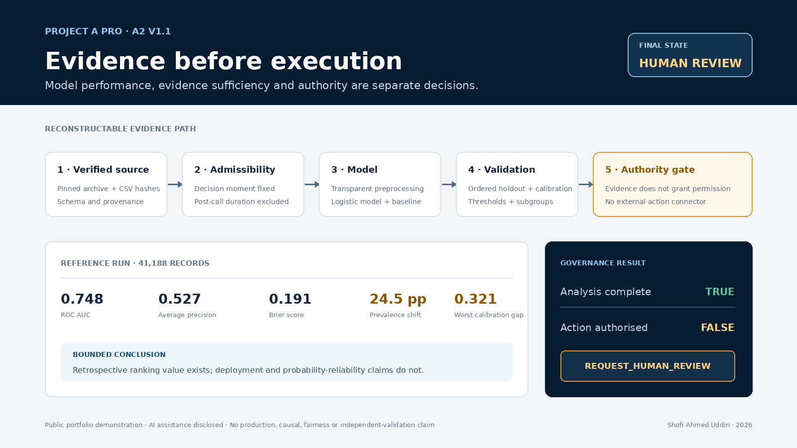
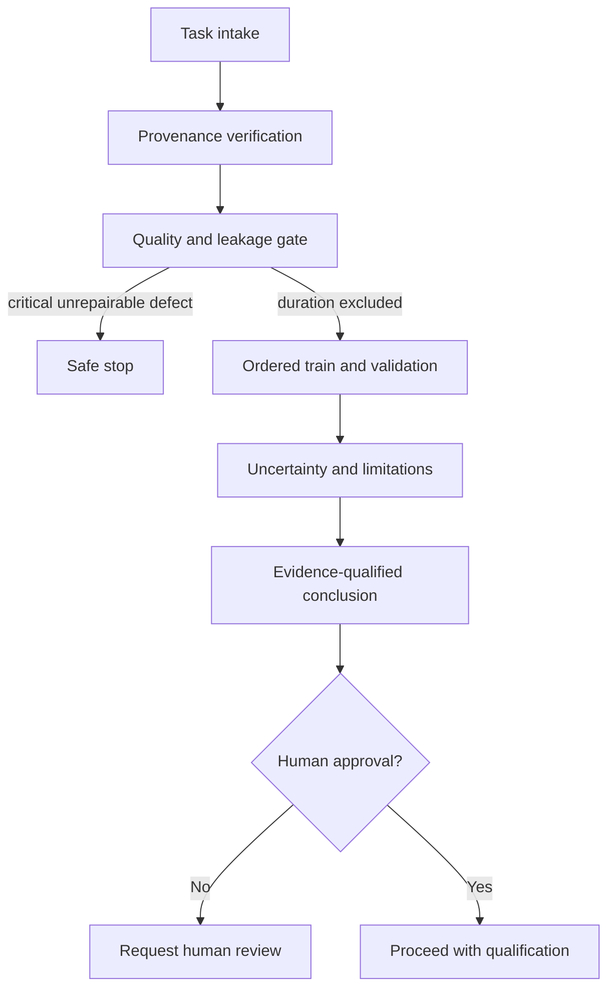

# Project A Pro — A2

## Evidence-Governed Agentic Data Scientist

**Status:** V1.1 hardened vertical slice implemented and tested.  
**Governing boundary:** `ANALYSIS COMPLETE` does not mean `ACTION AUTHORISED`.

A2 is an AI-assisted, deterministic agentic Data Science workflow that verifies data provenance, checks quality and temporal admissibility, trains and validates a bounded predictive model, reports uncertainty and limitations, and requires explicit human approval before any action state can be entered.

> Capability ≠ authority. A statistical result is not automatically admissible for action.



## Portfolio entry points

- [Client-facing case study](portfolio/CASE_STUDY.md)
- [Two-page client handout](output/pdf/A2_Client_Case_Study.pdf)
- [Static dashboard preview](portfolio/dashboard-preview.png)
- [90-second demonstration script](portfolio/DEMO_SCRIPT.md)
- [CV, LinkedIn and proposal wording](portfolio/COMMERCIAL_WORDING.md)
- [Technical objection register](portfolio/TECHNICAL_OBJECTIONS.md)
- [Controlled release manifest](portfolio/RELEASE_MANIFEST.md)

## What V1.1 proves

- The source archive and analytical CSV are hash-verified.
- The task is fixed at the **pre-contact** decision moment.
- Call `duration`, available only after the call, is detected and excluded as temporal leakage.
- “Unknown” categories are reported as semantic missingness rather than concealed by the source's no-missing-values label.
- An ordered 80/20 holdout is used because UCI describes the selected full dataset as date ordered.
- Logistic regression is compared with a prior-probability baseline; a tested class-weighted specification was rejected after materially degrading calibration.
- ROC AUC, average precision, Brier score, balanced accuracy, precision, recall, confusion counts, and an approximate AUC interval are exposed.
- Equal-width reliability diagnostics expose expected and maximum calibration error rather than treating ranking performance as reliable probability.
- Eight decision thresholds expose precision, recall, flagged volume, specificity and illustrative false-positive/false-negative costs; no threshold is automatically selected.
- Age-band, occupation and contact-channel diagnostics expose heterogeneous retrospective error while explicitly refusing a fairness-certification claim.
- Hostile target proxies and corrupted target labels fail closed, including when approval is supplied.
- The default final state is `REQUEST_HUMAN_REVIEW`; no external action is implemented.
- Unsupported causal language triggers `SAFE_STOP`.
- Each node writes an append-only JSONL audit trail.

This is a portfolio demonstration, not a deployable customer-contact, eligibility, pricing, or credit-decision system.

## Run

```bash
python scripts/run_v1.py --offline
python dashboard/build_dashboard.py
python -m unittest discover -s tests -v
python scripts/run_hostile_fixtures.py
```

The pinned UCI archive is included for reproducibility under CC BY 4.0. Remove `--offline` to download it when absent. `dashboard/index.html` is the primary interactive agent workspace; `python dashboard/build_dashboard.py` regenerates the fixed reference report at `dashboard/reference.html` so the live workspace is never overwritten.
The dashboard uses Plotly from its public CDN. The primary workspace now includes live Plotly governance visualisation in addition to the fixed reference charts; use `portfolio/dashboard-preview.png` as the offline static preview.

Adversarial safe-stop:

```bash
python scripts/run_v1.py --offline --causal
```

Explicit bounded demonstration approval:

```bash
python scripts/run_v1.py --offline --approve
```

The flag makes approval visible in the run record; it does not connect to or execute an external action.

## V1.1 workflow



The “agents” are bounded deterministic services, not free-running personas. This avoids agent theatre and makes each transition inspectable.

| Node | Explicit input | Explicit output | Failure behaviour |
|---|---|---|---|
| Orchestrator | Structured task | Run state | Rejects unsupported problem class |
| Provenance agent | Pinned archive | Source, DOI, licence, two hashes | Data-quality failure |
| Quality agent | Data + deployment moment | Findings + excluded features | Stop on schema/target failure |
| Statistical agent | Admissible columns | Fitted pipeline | Observable exception; no action |
| Validation agent | Ordered holdout predictions | Metrics + interval | Insufficient evidence |
| Governance gate | Findings, evidence, approval | Decision state | Defaults to human review/safe stop |
| Audit logger | Node event | Timestamped JSONL record | No silent transition |
| Visual surface | Final JSON report | Interactive evidence page | Refuses when no report exists |

## Dataset decision

Scoring scale: 1 (weak) to 5 (strong); total out of 35. “Build speed” rewards a credible Day-1 implementation.

| Candidate | Statistical richness | Modelling | Governance relevance | Commercial legibility | Reproducibility | Build speed | Visual potential | Total |
|---|---:|---:|---:|---:|---:|---:|---:|---:|
| **UCI Bank Marketing (selected)** | 5 | 5 | 5 | 5 | 5 | 5 | 4 | **34** |
| UCI Default of Credit Card Clients | 5 | 5 | 5 | 5 | 5 | 4 | 4 | 33 |
| UCI Online Shoppers Purchasing Intention | 4 | 5 | 3 | 5 | 5 | 5 | 5 | 32 |

Why Bank Marketing wins: it creates an unusually clear admissibility test. A high-performing but invalid pre-contact model can leak post-contact call duration. The dated source also supports a more credible ordered holdout, while class imbalance and “unknown” values require non-trivial quality and metric decisions. The credit-default dataset carries a higher risk of the demonstration being mistaken for a consequential credit system. Online shopping is fast and visually strong but has a weaker human-authority boundary.

Dataset: S. Moro, P. Rita, and P. Cortez, *Bank Marketing*, UCI Machine Learning Repository, DOI `10.24432/C5K306`, CC BY 4.0. The selected `bank-additional-full.csv` contains 41,188 records and 20 inputs, ordered by date from May 2008 to November 2010 according to UCI.

## Exact V1.1 acceptance contract

V1 passes only if all statements below are true:

1. **Provenance:** source URL, DOI, licence, retrieval mode, archive hash, and CSV hash are emitted.
2. **Schema:** all 21 expected columns, including target, are checked before modelling.
3. **Quality:** machine nulls, exact duplicates, impossible ages, semantic “unknown” values, target encoding, and imbalance are visible.
4. **Temporal admissibility:** `duration` is excluded for the pre-contact task and recorded as a critical repaired finding.
5. **Method:** a documented, reproducible preprocessing and logistic-regression pipeline runs with a recorded seed.
6. **Validation:** no-shuffle ordered holdout, prior baseline, and imbalance-aware discrimination/calibration metrics are emitted.
7. **Uncertainty:** an explicitly approximate 95% AUC interval and its excluded uncertainties are reported.
8. **Claims:** no causal, deployment, fairness, or generalisation claim exceeds the evidence.
9. **Governance:** a completed run without approval ends in `REQUEST_HUMAN_REVIEW`, with `action_authorised=false`.
10. **Safe stop:** a causal request and an unrepairable critical data defect cannot reach an action state.
11. **Auditability:** task, provenance, checks, validation, and governance decision are recorded in JSONL.
12. **Visual evidence:** status, leakage exclusion, validation, gates, evidence chain, and limitations appear in the dashboard.
13. **Testing:** the unit suite passes and covers leakage, missing target, semantic missingness, approval separation, and causal safe-stop.
14. **Publication:** no credentials, secrets, private paths, or unsupported professional claims are included.
15. **Calibration:** reliability bins, ECE, maximum bin error and calibration-in-the-large are reconstructable.
16. **Thresholds:** decision consequences and assumptions are visible; no operating threshold is silently selected.
17. **Subgroups:** small groups are suppressed and the output is labelled diagnostic rather than fairness evidence.
18. **Contamination:** deterministic and near-perfect target proxies trigger a critical failure before modelling.

## 24–48 hour build plan

| Window | Deliverable | Proof |
|---|---|---|
| Day 1, first half | Dataset/provenance contract, bounded agent graph, quality and leakage gate | Hash verification; test detects/excludes duration |
| Day 1, second half | Ordered modelling/validation vertical slice, approval separation, audit log | Reproducible report; default human-review state; passing tests |
| Day 2, first half | Interactive Plotly evidence surface, adversarial fixtures, evidence ledger | Dashboard and safe-stop runs |
| Day 2, second half | README, methods, limitations, disclosure, packaging and hostile publication review | Clean archive; rerun instructions; claim audit |

## End-of-Day-1 definition

Working now: pinned source ingestion, dual hash verification, task boundary, schema and quality checks, temporal leakage repair, ordered predictive pipeline, baseline comparison, uncertainty statement, human-approval state separation, causal safe-stop, audit logging, tests, and generated evidence dashboard.

Completed in V1.1: target-contamination and corrupted-label fixtures, calibration reliability curves, threshold/cost sensitivity, subgroup diagnostic design, exact tested dependency pins and a clean-environment reproduction. Remaining future work includes multicollinearity stress tests, prospective recalibration, CI across supported Python versions and genuinely independent human reproduction.

## Repository map

```text
config/       frozen V1 controls
schemas/      machine-readable intake contract
src/a2/       bounded workflow services
scripts/      runnable entry point
tests/        governance and quality regression tests
dashboard/    interactive agent workspace + generated Plotly reference surface
evidence/     claim ledger
docs/         architecture and decision records
data/raw/     pinned CC BY dataset archive
outputs/      run reports, predictions, audit logs
```

## Portfolio wording

“Built an AI-assisted agentic Data Science system that performs provenance-aware data intake, data-quality assessment, justified model selection, temporal validation, uncertainty handling and evidence-qualified analysis, with explicit human approval and safe-stop controls.”

See [AI_ASSISTANCE_DISCLOSURE.md](AI_ASSISTANCE_DISCLOSURE.md), [LIMITATIONS.md](LIMITATIONS.md), and [GOVERNANCE.md](GOVERNANCE.md) before reusing that wording.
